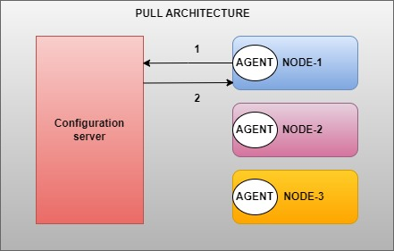
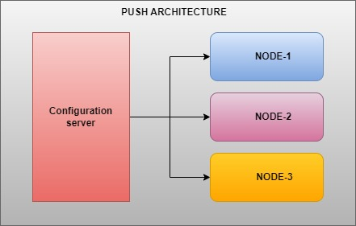
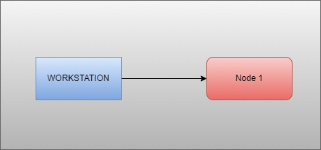

Ansible :- 

*   Disadvantages of shellscript:- 
    1) shellscript is homogenius 
        . useradd roboshop--> centos
        . add user roboshop--> ubuntu
    One shellscript can only work one paticular distribution.
    2) Every time we need to validate .
    3) Imperative vs Declarative .
        . Imperative :- little tough sysntax & Very strict syntax & Follows in sequence.
        . declerative :- easy syntax , No need of sequence , we can write anywhere .
                            ( What ever you write we get it )
    
------> Here just keep an idea that the shell-script was imperative and the ansible was declerative.

1) Ansible can query the server , it can understand what os it is ,based on that it can change the command.
2) you no need to write validations.
3) Ansible can connect any no.of servers , no need to login to the server.
4) Also it was declerative, No need of sequence in and easy syntax .

### How it works .
1) Before ansible there is pull mechanism.
---> There are 2 things :- 
    1) chef 
    2) Puppet

 

### How the pull mechanism works here ?

* In pull mechanism the nodes will pull the code from the server .
    1) first node will connect to server.
    2) Pull the configuration.
    3) Run the configuration.
Another Disadvantage is that we need to configure how to frequently nodes should connect to the server
once in 30 min .
(In this case for every 30 min nodes will connect to the CHEF SERVER & Pull the configuration )
*  Ex:- LIC agent

* Push mechanism .
    . Here no.of steps will be reduced .
    . here we no need of any agent .
    configuration server ---> Ansible server 
. And directly we can push the configuration .

### Push mechanism
    
 

* For example :- Take LIC Used case .

AT ealier times :- 1) You pay to agent .
                   2)  Agent pay to LIC Office

Present times :- 1) We are able to pay directly and no need of the agent .

> Important :- 
    Another disadvantage of pull :- 
        1) Pull mechanism will have additional agent software .
        2) There May not be any change in configuartion all the time.
        3) change in configuration is very rare , so The wastage of data ,Power etc...
        ex :- Evry 30 min , The traffic is geting more ,there is some data ,Power , Node is connecting to the server & it is fetching it ,but mostly there will be no change ,so it was waste of data .

PUSH :- 1) Here we don't have any agent & We can directly push the configuration ,"This is ADVANTAGE".
        2) Also here there is no wastage of data also .

* Earlier we are using the using "Chef & Puppet" which is popular , But now a days we are using the Ansible server.

#### How to install ANSIBLE:- 
        1) Take root access.
        2) Yum install Ansible 

"Ansible devopled basing on python That is why it will download python package".

##### how to attach NODE to Ansible :- 

    - After installing Ansible 
    - Run (Basically we wont use this )

Command Line :- 
Ansible -i <Privateip>, all -e ansible -e ansible_user centos -e ansible_Password=DevOps321 -m ping 

        here We are telling ansible :- 
            - i ---> Inventory
            -m  ping ---> if the server is like we will get "Pong" In response  
            if not ---> It shows Failed ..

    * In background ansible uses "SSH" authentication where it needs :- Ip , pass, username .

    In linux we keep the command in shellscript in the same way.
    Ex  :- Shellscript.

In ansible it is know as **Playbook**

* PlayBook ---> keeping all the ansible collections (i.e command in linux) and run it .

##### Session 18 :- 

As we know the anisble uses ssh authentiation .
- genrally while working with ansible we will find a thing called "Inventory".
- Inventory is nothing but list of hosts that server is managing .

- so we have our ansible server 

   ANSIBLE server is nothing but where we installed ansible.

   So in inventory we have 1 i.e NODE 1.
 
Note :- Genrally Inventory is recommended but not compulsory .

So There is proper way :- 

Think There is a company "ROBOSHOP"
geography :- IND,us,UK,AUS Etc.
Env:- Dev,QA,PROD
Component:- WEB,APP,DB
Server :- Mongodb , CART, catalogue

We have 4 different kinds of server basing upon 4 things.   
    - Naming the servers is the best practice .
for ex:- Roboshop-us-dev-db-mongodb01
    (By seeing the above name we can understand where it belongs to)

* This method also will be followed in Real time basis.

-we always group the server .
    - So let us take a inventory file and group "Mongob" Servers. (REFFER INVENTOR)

    - Lets take it as Mongodb.

>    [Mongodb] (We have to create a Route 53 record for it )

    roboshop-us-dev-db-monogodb-01.awsdevopsjoin.online 

[Mongodb]
roboshop-us-dev-db-monogodb-01.awsdevopsjoin.online 

[mysql]
roboshop-us-dev-db-mysql-01.awsdevopsjoin.online
roboshop-us-dev-db-mysql-02.awsdevopsjoin.online
roboshop-us-dev-db-mysql-03.awsdevopsjoin.online

[cart]
roboshop-us-dev-db-cart-01.awsdevopsjoin.online
roboshop-us-dev-db-cart-02.awsdevopsjoin.online
roboshop-us-dev-db-cart-03.awsdevopsjoin.online

[User]
roboshop-us-dev-db-user-01.awsdevopsjoin.online
roboshop-us-dev-db-user-02.awsdevopsjoin.online
roboshop-us-dev-db-user-03.awsdevopsjoin.online

[db:children]
Mongodb
mysql

#Why it is like this:-if you want to push any update to entire apptier, api tier , backend tier ,
then refer this app

[app:children]
cart 
user

* How to check ping 
VIM Inventory

[Mongodb]
roboshop-us-dev-db-monogodb-01.awsdevopsjoin.online 

 ansible -i inventory Mongodb -m ping -u centos --ask-pass

 RESPONCE:- 

ansible -i inventory Mongodb -m ping -u centos --ask-pass
SSH password:
roboshop-us-dev-db-monogodb-01.awsdevopsjoin.online | SUCCESS => {
    "ansible_facts": {
        "discovered_interpreter_python": "/usr/libexec/platform-python"
    },
    "changed": false,
    "ping": "pong"
}

#### As we already discussed our task is install nginx Node -1

* Now we will check how to install the nginx in node 1 without logging in :-

Genrally in shellscript or linux server we use :- yum install nginx -y ---> Command
But in ansible it will be called as :- Module/collection

---> we knew the command syntacx :- 

        Command <option> <inputs>
        ex :- cp <source> <destination>

    Similarly in ansible syntax is :-

        Module/collection name <parameters>

Now let us take ansible documentation 
* refer ansible documentaion 

**ansible -i inventory Mongodb -e ansible_user=centos -e ansible_password=DevOps321 -m ping**
#Here i checked the connecion but i want to installed the package .

    roboshop-us-dev-db-monogodb-01.awsdevopsjoin.online | SUCCESS => {
        "ansible_facts": {
            "discovered_interpreter_python": "/usr/libexec/platform-python"
        },
        "changed": false,
        "ping": "pong"
    }

In previous times we are using the module commands ,But Now every one was using **ADHOC** commands. (Pink colour)
> The word "ADHOC" Means emergency purpose .

**ansible -i inventory Mongodb -e ansible_user=centos -e ansible_password=DevOps321 -m ansible.builtin.yum -a "name=nginx state=installed"**
#here we got error becomes it should be run in the root access.

    roboshop-us-dev-db-monogodb-01.awsdevopsjoin.online | FAILED! => {
        "ansible_facts": {
            "discovered_interpreter_python": "/usr/libexec/platform-python"
        },
        "changed": false,
        "msg": "This command has to be run under the root user.",
        "results": []
    }

- How to get root access ?
    We can get the root access just by using -b/--become i.e it means to take root access

 **ansible -i inventory Mongodb --become -e ansible_user=centos -e ansible_password=DevOps321 -m ansible.builtin.yum -a "name=nginx state=installed"**

roboshop-us-dev-db-monogodb-01.awsdevopsjoin.online | CHANGED => {
    "ansible_facts": {
        "discovered_interpreter_python": "/usr/libexec/platform-python"
    },
    "changed": true,
    "msg": "",
    "rc": 0,
    "results": [
        "Installed: nginx-mod-http-xslt-filter-1:1.14.1-9.module_el8.0.0+1060+3ab382d3.x86_64",
        "Installed: dejavu-fonts-common-2.35-7.el8.noarch",
        "Installed: dejavu-sans-fonts-2.35-7.el8.noarch",
        "Installed: nginx-mod-mail-1:1.14.1-9.module_el8.0.0+1060+3ab382d3.x86_64",
        "Installed: libxcb-1.13.1-1.el8.x86_64",
        "Installed: libtiff-4.0.9-29.el8.x86_64",
        "Installed: nginx-mod-stream-1:1.14.1-9.module_el8.0.0+1060+3ab382d3.x86_64",
        "Installed: jbigkit-libs-2.1-14.el8.x86_64",
        "Installed: libX11-1.6.8-7.el8.x86_64",
        "Installed: libX11-common-1.6.8-7.el8.noarch",
        "Installed: libjpeg-turbo-1.5.3-12.el8.x86_64",
        "Installed: libXau-1.0.9-3.el8.x86_64",
        "Installed: nginx-1:1.14.1-9.module_el8.0.0+1060+3ab382d3.x86_64",
        "Installed: gd-2.2.5-7.el8.x86_64",
        "Installed: nginx-all-modules-1:1.14.1-9.module_el8.0.0+1060+3ab382d3.noarch",
        "Installed: nginx-filesystem-1:1.14.1-9.module_el8.0.0+1060+3ab382d3.noarch",
        "Installed: libwebp-1.0.0-9.el8.x86_64",
        "Installed: libxslt-1.1.32-6.el8.x86_64",
        "Installed: nginx-mod-http-image-filter-1:1.14.1-9.module_el8.0.0+1060+3ab382d3.x86_64",
        "Installed: libXpm-3.5.12-11.el8.x86_64",
        "Installed: fontconfig-2.13.1-4.el8.x86_64",
        "Installed: nginx-mod-http-perl-1:1.14.1-9.module_el8.0.0+1060+3ab382d3.x86_64",
        "Installed: fontpackages-filesystem-1.44-22.el8.noarch"
    ]
}

* In above we installed the package But now we want to start it ?

**ansible -i inventory Mongodb --become -e ansible_user=centos -e ansible_password=DevOps321 -m ansible.builtin.service -a "name=nginx state=started"**
#this is nothing but (systemctl start nginx)

    roboshop-us-dev-db-monogodb-01.awsdevopsjoin.online | CHANGED => {
        "ansible_facts": {
            "discovered_interpreter_python": "/usr/libexec/platform-python"
        },
        "changed": true,
        "name": "nginx",
        "state": "started",

#### Now check by logging to Node -1 The package will be installed .
 > Here we installed the package without logging into server by using the ADHOC commands. we did using the ansible server.

  systemctl status nginx
● nginx.service - The nginx HTTP and reverse proxy server
   Loaded: loaded (/usr/lib/systemd/system/nginx.service; disabled; vendor preset: disabled)
   Active: active (running) since Wed 2023-11-08 06:50:58 UTC; 4min 54s ago

* Note :- ADHOC commands are not reusable .
(And this is clear that it was not a proper way to run the code)

Just like in shellscript we call in ANSIBLE as **PLAYBOOK**
 - Playbook ----> Keep all ansible module/collections in YAML File and run that file .

# YAML SYNTAX :- 

-> Yet it was a another Markup language.
It is another type of "HTML" :- Hyper text mark up language .
similarly we are having several markup languages 
    - XML :- Extensible mark up language (44:35) 

* FOR Ex :- BANK Depsoit form 
Tempalte /Form :- Easy for cashier .

In simalar way :

* FB WEB ----> Fb BACKEND -----> FB DB (How it was getting Data transffering)

This was using the **DTO** -->  DATA TRANSFER OBJECTS .

- Now how effectively / accurately You transfer the b/w the multiple servers is the matter.

1 Possible thing is XML:- 
    The goal is signup :- We need to take the user info and send user component in the backend .

How the system share the details i.e using XML as mentioned below :- 

        <person>
            <Name>Sai arun yadav</Name>
            <DOB>17-11-1999</DOB>
            <Country>india</Country>
            <City>KADAPA</City>
        </person>    

* Here Every thing is value and there is a key between the markups is called as value.

Now I need this format as **NESTED**
* NESTED :- 

 

